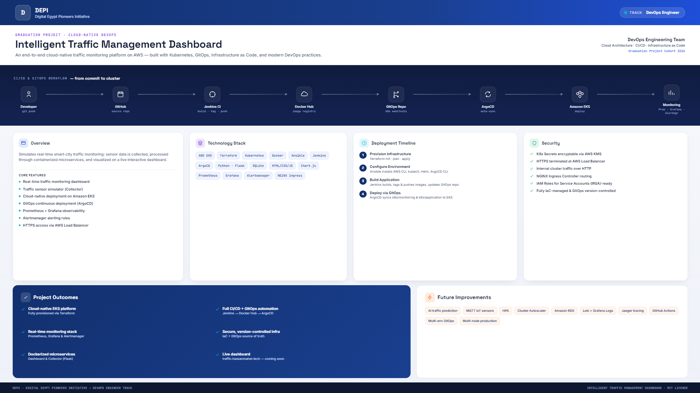
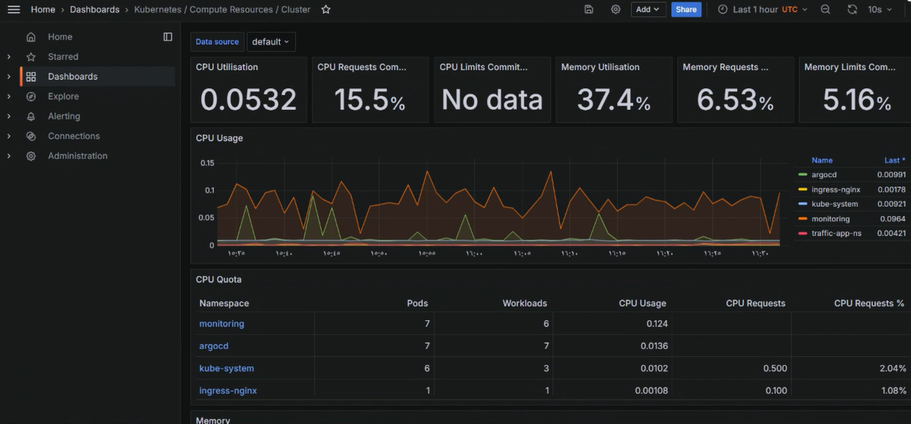
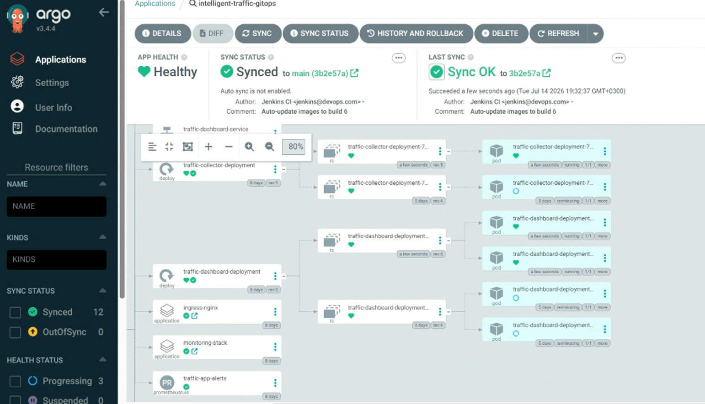
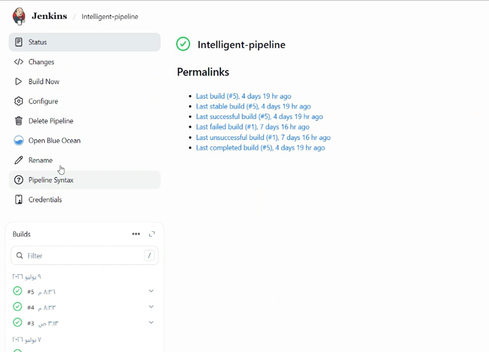
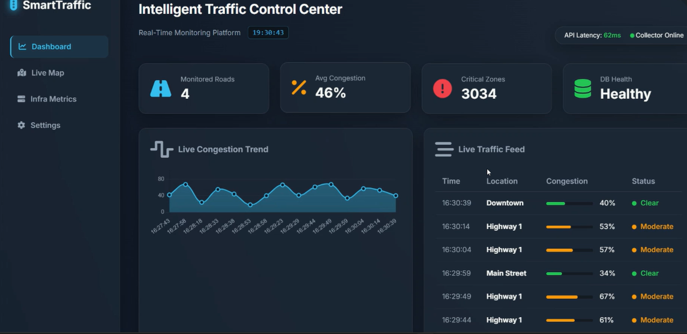

# 🚦 Intelligent Traffic Management Dashboard

<p align="center">  
  
</p>

<p align="center">
  <b>An End-to-End Cloud-Native Intelligent Traffic Monitoring Platform built on AWS using Kubernetes, GitOps, Infrastructure as Code, and Modern DevOps Practices.</b>
</p>


</p>
---

## 🎬 Project Demo Video


https://github.com/user-attachments/assets/567873c8-8678-4af5-baac-3ad3624f6bf0


---

# 📖 Overview

The **Intelligent Traffic Management Dashboard** is a complete cloud-native DevOps project that simulates real-time smart city traffic monitoring.

The platform collects simulated traffic sensor data, processes it through containerized microservices, and visualizes live traffic statistics on an interactive dashboard.

The entire infrastructure is provisioned using **Terraform**, deployed on **Amazon EKS**, automated through **Jenkins**, and continuously synchronized using a **GitOps workflow with ArgoCD**.

Infrastructure health and application performance are monitored with **Prometheus**, **Grafana**, and **Alertmanager**.

---

# ✨ Features

* 🚦 Real-time traffic monitoring dashboard
* 📡 Traffic sensor simulator (Collector)
* ☁️ Cloud-native deployment on Amazon EKS
* 🐳 Dockerized microservices
* ⚙️ Infrastructure as Code using Terraform
* 🔧 Configuration management with Ansible
* 🚀 Automated CI pipeline using Jenkins
* 🔄 GitOps Continuous Deployment using ArgoCD
* 📈 Prometheus metrics collection
* 📊 Grafana dashboards
* 🚨 Alertmanager alerting rules
* 🌐 HTTPS access using AWS Load Balancer
* 🔒 Secure cloud infrastructure
* 📦 Kubernetes Deployments, Services, ConfigMaps, Ingress and Persistent Volumes

---

# 🏗️ Project Architecture

The repository contains the complete lifecycle of the application.

| Directory    | Description                                   |
| ------------ | --------------------------------------------- |
| `app/`       | Flask microservices (Dashboard & Collector)   |
| `terraform/` | AWS Infrastructure provisioning               |
| `ansible/`   | Environment setup and automation              |
| `jenkins/`   | CI Pipeline                                   |
| `k8s/`       | Kubernetes manifests (GitOps Source of Truth) |
| `docs/`      | Architecture diagrams and screenshots         |

---

# 📂 Repository Structure

```text
.
├── ansible/
│   └── playbook.yml

├── app/
│   ├── collector/
│   └── dashboard/

├── docs/
│   ├── architecture.png
│   ├── dashboard.png
│   ├── grafana.png
│   ├── prometheus.png
│   ├── argocd.png
│   └── jenkins.png

├── jenkins/
│   └── Jenkinsfile

├── k8s/
│   ├── application/
│   └── monitoring/

└── terraform/
    ├── modules/
    └── ...
```

---

# 🛠️ Technology Stack

| Category                 | Technology                      |
| ------------------------ | ------------------------------- |
| Cloud Provider           | AWS                             |
| Containerization         | Docker                          |
| Container Orchestration  | Kubernetes (Amazon EKS)         |
| Infrastructure as Code   | Terraform                       |
| Configuration Management | Ansible                         |
| Continuous Integration   | Jenkins                         |
| Continuous Deployment    | ArgoCD (GitOps)                 |
| Backend                  | Python, Flask                   |
| Database                 | SQLite                          |
| Frontend                 | HTML, CSS, JavaScript, Chart.js |
| Monitoring               | Prometheus                      |
| Visualization            | Grafana                         |
| Alerting                 | Alertmanager                    |
| Networking               | NGINX Ingress Controller        |

---

# 🔄 CI/CD & GitOps Workflow

```text
                    Developer
                        │
                        ▼
                Push Code to GitHub
                        │
                        ▼
                Jenkins Pipeline
                        │
        ┌───────────────┴───────────────┐
        │                               │
        ▼                               ▼
 Build Dashboard Image          Build Collector Image
        │                               │
        └───────────────┬───────────────┘
                        ▼
              Push Images to Docker Hub
                        │
                        ▼
            Update GitOps Repository
                        │
                        ▼
          ArgoCD Detects Repository Changes
                        │
                        ▼
               Deploy to Amazon EKS
                        │
                        ▼
      Prometheus → Grafana → Alertmanager
```

---

# 🚀 Getting Started

## 1️⃣ Provision Infrastructure

```bash
cd terraform

terraform init

terraform plan

terraform apply --auto-approve
```

After provisioning, configure your Kubernetes context using the generated AWS CLI command.

---

## 2️⃣ Configure Environment

```bash
cd ansible

ansible-playbook playbook.yml
```

This installs required tools such as:

* AWS CLI
* kubectl
* Helm
* ArgoCD CLI

---

## 3️⃣ Build Application

Configure Jenkins to use the provided Jenkinsfile.

The pipeline automatically:

* Builds Docker images
* Tags images
* Pushes images to Docker Hub
* Updates the GitOps repository

---

## 4️⃣ Deploy using GitOps

Install ArgoCD, then deploy the manifests.

```bash
kubectl apply -k k8s/monitoring/

kubectl apply -k k8s/application/
```

ArgoCD continuously monitors the Git repository and automatically synchronizes the Kubernetes cluster whenever changes are pushed.

---

# 📊 Monitoring & Observability

The project includes a complete monitoring stack.

## Grafana Dashboard

<p align="center">

</p>


---

## ArgoCD

<p align="center">

</p>

---

## Jenkins Pipeline

<p align="center">

</p>

---

## Application Dashboard

<p align="center">

</p>

---

# 🚨 Alerting

Alertmanager is configured with custom Prometheus alert rules.

Example alerts include:

* Traffic Dashboard Down
* Collector Down
* High CPU Usage
* High Memory Usage
* Pod Restart Detection

Alerts can easily be extended to Email, Slack, or Microsoft Teams.

---

# 🔒 Security

This project follows cloud security best practices.

* Kubernetes Secrets can be encrypted using AWS KMS.
* HTTPS is terminated at the AWS Load Balancer.
* Internal communication uses HTTP inside the cluster.
* NGINX Ingress Controller manages routing.
* IAM Roles for Service Accounts (IRSA) can be integrated.
* Infrastructure is fully managed through Infrastructure as Code.
* Kubernetes configuration is version-controlled using GitOps.

---

# 📸 Project Screenshots

| Component    | Screenshot                   |
| ------------ | ---------------------------- |
| Architecture | docs/images/architecture.png |
| Dashboard    | docs/images/dashboard.png    |
| Grafana      | docs/images/grafana.png      |
| Prometheus   | docs/images/prometheus.png   |
| Jenkins      | docs/images/jenkins.png      |
| ArgoCD       | docs/images/argocd.png       |

---

# 🌍 Live Demo

> **Coming Soon**

Example:

```
https://traffic.hassanmaher.tech
```

---

# 📌 Future Improvements

* AI-powered traffic prediction
* MQTT support for real IoT sensors
* Multi-node production deployment
* Horizontal Pod Autoscaler (HPA)
* Cluster Autoscaler
* Amazon RDS integration
* Loki & Grafana Logs
* Distributed Tracing with Jaeger
* GitHub Actions support
* Multi-environment GitOps (Dev / Staging / Production)

---

# 👨‍💻 Author

**Hassan Maher Hassan Almahrouq**

Electronics & Communications Engineering Student

Cloud & DevOps Engineer

### Connect with me

* GitHub: https://github.com/hassan-maher-dev
* LinkedIn: *(Add your LinkedIn profile here)*
* Portfolio: https://www.hassanmaher.tech

---

# 📄 License

This project is licensed under the MIT License.
